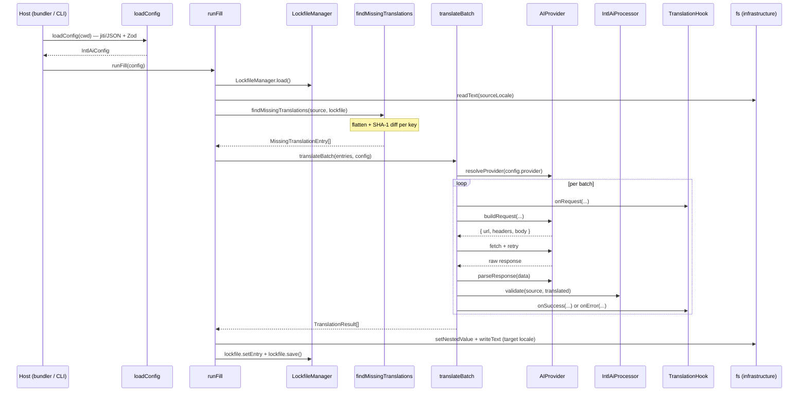

# Architecture

intl-ai is a build-time i18n translation system. It runs entirely during the build step, translates missing or stale JSON/YAML locale keys using any AI provider, and writes results back to disk before the bundler emits its output. There is zero runtime overhead and zero coupling to the host application's i18n library.

For product context and roadmap see `.agents/docs/prd.md`. For the api-internal contributor guide, the dependency rule enforcement details, and the planned Rust/TS v1 language boundary, see `packages/api/AGENTS.md`.

---

## Monorepo and package graph

Four packages are published to npm. One shared config package is internal only.

| Package | npm name | Purpose |
| --- | --- | --- |
| `packages/api` | `@intl-ai/api` | Runtime-agnostic core: `runFill`, `runCheck`, `IntlAiConfig`, `IntlAiConfigSchema` |
| `packages/unplugin` | `@intl-ai/unplugin` | Universal bundler plugin via unplugin 3 (Vite, Rollup, Webpack, esbuild, Rspack, Rolldown, Farm; Bun and Nuxt adapters) |
| `packages/next` | `@intl-ai/next` | Next.js `withIntlAi()` wrapper: webpack plugin and Turbopack loader |
| `packages/cli` | `@intl-ai/cli` | `intl-ai fill` and `intl-ai check` commands |
| `packages/typescript-config` | `@repo/typescript-config` | Shared tsconfig, internal only |

**Dependency graph:**

```
@intl-ai/cli ─────────────────┐
@intl-ai/unplugin ────────────┼── (workspace:*) ──> @intl-ai/api
@intl-ai/next ────────────────┘
    │
    └── also depends on @intl-ai/unplugin (webpack sub-export)
```

`@intl-ai/api` exposes two surfaces:

- **Public** (`index.ts`): `runFill`, `runCheck`, `IntlAiConfig`, `IntlAiConfigSchema`. Stable, semver-guarded.
- **Intra-monorepo** (`internal.ts`): named re-exports of adapters, infrastructure utilities, lockfile, schema helpers. Consumed by `cli`, `unplugin`, and `next`; not intended for external callers.

The examples (`expo`, `flutter`, and others) consume the `intl-ai` CLI binary rather than the library. The library never enters the host app's runtime.

---

## Hexagonal rings inside `@intl-ai/api`

The api package follows a strict Hexagonal (Ports and Adapters) layout. Dependency always flows inward: outer rings may import inner rings; inner rings never import outward.

```
┌─────────────────────────────────────────┐
│            infrastructure               │  Node.js IO, config loader
│  ┌───────────────────────────────────┐  │
│  │            adapters               │  │  Provider, format, processor impls
│  │  ┌─────────────────────────────┐  │  │
│  │  │          services           │  │  │  Fill slice, Check slice (never sibling imports)
│  │  │  ┌───────────────────────┐  │  │  │
│  │  │  │     ports / core      │  │  │  │  Interfaces + pure domain
│  │  │  └───────────────────────┘  │  │  │
│  │  └─────────────────────────────┘  │  │
│  └───────────────────────────────────┘  │
└─────────────────────────────────────────┘
```

### Ring map

| Directory | Ring | Purpose |
| --- | --- | --- |
| `core/` | Core | `findMissingTranslations`, `flattenObject`, `hashSha1` (SHA-1 via Web Crypto), domain types. Zero IO. |
| `lockfile/` | Core-adjacent | `LockfileManager` plus types. Domain-adjacent, not pure. |
| `ports/` | Ports | Four interfaces that define the hexagon edges (see below). |
| `services/fill/` | Services | `runFill` plus `translateBatch`. Imports only `core` and `ports`. |
| `services/check/` | Services | `runCheck`. Imports only `core` and `ports`. Sibling slices never import each other. |
| `adapters/providers/` | Adapters | `openai.ts`, `anthropic.ts`, `registry.ts`. |
| `adapters/processors/` | Adapters | `icu.ts`, `passthrough`, `createProcessor`. |
| `adapters/formats/` | Adapters | `json.ts`, `yaml.ts` (each implements `LocaleFormat`). |
| `infrastructure/` | Infrastructure | `fs.ts` (Node.js file system wrappers), `config/loader.ts` (jiti + JSON + Zod). The only Node-coupled code. |
| `schema/` | Schema | Zod schema, JSON Schema file, `jsonConfigToIntlAiConfig`. |

### The four port interfaces

```ts
interface AIProvider {
  readonly id: string;
  buildRequest(opts: { model: string; systemPrompt: string; userPrompt: string;
    temperature: number; modelParams?: Record<string, unknown> }):
    { url: string; headers: Record<string, string>; body: Record<string, unknown> };
  parseResponse(data: unknown): { content: string };
}

interface IntlAiProcessor {
  name: string;
  extractTokens(message: string): string[];
  validate(source: string, translated: string): ValidationResult;
  getSyntaxHint(): string;
}

interface LocaleFormat {
  extension: string;
  read(path: string): Promise<Record<string, unknown>>;
  write(path: string, data: Record<string, unknown>): Promise<void>;
}

interface TranslationHook {
  onRequest?: (info: { provider: string; model: string; locale: string; entryCount: number }) => void;
  onSuccess?: (info: { provider: string; model: string; locale: string;
    results: TranslationResult[]; durationMs: number }) => void;
  onError?: (info: { provider: string; model: string; locale: string;
    error: string; attempt: number }) => void;
}
```

### Dependency rule

`core` and `ports` import nothing from outer rings. Each `services/<slice>` imports `core` and `ports` only and never imports a sibling slice. `adapters` and `infrastructure` may import `core` and `ports`.

This rule is enforced statically by `packages/api/oxlintrc.json` via `no-restricted-imports` overrides. CI fails on any violation.

---

## Data flow: build-time fill

The sequence below traces `intl-ai fill` from config load to disk write.



`runCheck` follows the same path through `loadConfig` and `findMissingTranslations` but makes no provider calls and writes nothing to disk. It returns the diff as a structured report.

---

## Integration paths

Two mechanisms exist for invoking the fill pipeline, depending on host environment.

### 1. In-process build hook

Used by Vite, Webpack, Rollup, esbuild, Rspack, Rolldown, Farm, and Next.js.

```
bundler buildStart
  -> @intl-ai/unplugin (or @intl-ai/next)
  -> dynamic import("@intl-ai/api")
  -> runFill(config)
```

The plugin loads lazily so `@intl-ai/api` is only evaluated when the bundler actually starts a build. The library runs in the same Node.js process as the bundler.

### 2. External CLI invocation

Used by Expo, Flutter, SwiftUI, and other native targets that have no JavaScript bundler in the build graph.

```
native build step (shell)
  -> intl-ai fill (CLI binary)
  -> runFill(config)
```

The CLI binary is a standalone Node.js process. The library never enters the host application's runtime. Config is loaded from `intl-ai.config.ts` or `intl-ai.config.json` at the project root, identical to the bundler path.

---

## Extending the system

**New AI provider**: implement `AIProvider` (`ports/provider.ts`) and register it in `adapters/providers/registry.ts`. No other files need to change.

**New locale format**: implement `LocaleFormat` (`ports/format.ts`) and add it under `adapters/formats/`.

**New processor/validator**: implement `IntlAiProcessor` (`ports/processor.ts`) and add it under `adapters/processors/`.

**New use-case**: add a slice under `services/<feature>/` with its own `index.ts` barrel. Import only `core` and `ports` from within the slice. Export through `internal.ts`.

See `packages/api/AGENTS.md` for the full contributor guide including the `core`/`ports` boundary contract for the planned Rust/TS v1 language seam.
